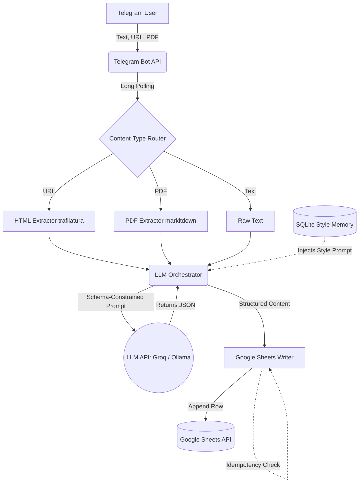

# Multi-Format Telegram Content Agent

A sophisticated, multi-format content ingestion agent operating via Telegram. This bot accepts content in plain text, web links, and PDF documents, processes it using Large Language Models (LLMs like Groq or local Ollama) for intelligent structuring, and logs the drafts into a Google Sheet.

It is designed with production-minded resilience, handling API rate limits, unstructured outputs from LLMs, and webhook sleeping issues by employing a long-polling architecture.

## Features
- **Multi-Format Ingestion**: Parses Text, URLs (via `trafilatura`), and layout-rich PDFs (via `markitdown`).
- **Idempotent Writes**: Prevents duplicate entries to Google Sheets by verifying source identifiers via local caching.
- **Persistent Style Memory**: Stores user-defined style instructions in SQLite, dynamically injecting them into future LLM generations.
- **Schema-Constrained Generation**: Uses LLMs to generate titles, rationales, and social media variants (X, LinkedIn) in strict JSON format with exponential backoff retries.

## System Architecture



## Setup Instructions

### 1. Prerequisites
- **Docker & Docker Compose**: Ensure you have Docker installed on your machine.
- **Telegram Bot Token**: Go to Telegram, search for `@BotFather`, use `/newbot` to create a bot, and copy the provided HTTP API Token.
- **Google Cloud Service Account**: 
  - Create a project in Google Cloud Console.
  - Enable the **Google Sheets API** and **Google Drive API**.
  - Create a Service Account, generate a JSON key, and download it.
  - Create a new Google Sheet and share it (Editor access) with the Service Account email address.
- **LLM Provider**:
  - Get a free API key from [Groq](https://console.groq.com/).
  - *Optional*: Run [Ollama](https://ollama.com/) locally.

### 2. Installation
Clone this repository and navigate to the directory:
```bash
git clone https://github.com/SivaGaneshv1729/telegram-content-agent.git
cd telegram-content-agent
```

Rename the environment template:
```bash
cp .env.example .env
```

Edit the `.env` file and fill in your credentials:
```env
TELEGRAM_BOT_TOKEN=your_telegram_bot_token_here
GOOGLE_SHEETS_CREDENTIALS_JSON='{"type": "service_account", ...}'
SPREADSHEET_ID=your_google_spreadsheet_id_here
GROQ_API_KEY=your_groq_api_key_here
```

### 3. Running the Bot
Start the application using Docker Compose:
```bash
docker-compose up --build -d
```
The agent will initialize its SQLite database and connect to Telegram via long polling.

## Usage Guide

1. Open Telegram and start a chat with your bot.
2. Send `/start` to verify the bot is alive.
3. Send `/setstyle <your preference>` to set a permanent style memory.
   - Example: `/setstyle Write in a witty, highly professional tone and always use bullet points for LinkedIn.`
4. Send content to the bot:
   - **Text**: Send a paragraph of text directly.
   - **Link**: Send a URL (e.g., a news article).
   - **PDF**: Upload a PDF file directly in the chat.
5. The bot will acknowledge the receipt, process the content via the LLM, and successfully log the generated title, rationale, and platform-specific drafts into your Google Sheet!

## FAQ

**Q: Why use Long Polling instead of Webhooks?**
A: Free-tier hosting platforms often "sleep" after periods of inactivity. A webhook message arriving while the server is cold-starting can be lost forever. Long Polling actively pulls updates, ensuring the application remains awake and no messages are dropped.

**Q: How do you handle LLMs returning messy text instead of JSON?**
A: The orchestrator uses explicit system prompts defining the exact JSON schema required. If the LLM returns invalid JSON, the orchestrator catches the exception and initiates a retry loop with exponential backoff, passing the error back to the LLM to self-correct.

**Q: Why `microsoft/markitdown` for PDFs instead of standard text extractors?**
A: Standard text extractors destroy document structure, flattening tables and lists. `markitdown` preserves this semantic layout by converting it to Markdown, which LLMs understand natively, drastically improving the output quality.
